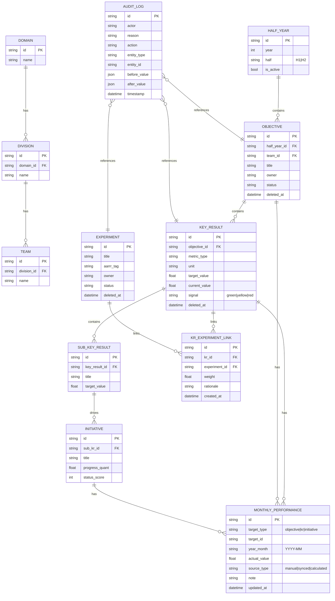

# OKR Dashboard ERD & Data Rules v1.0

작성일: 2026-02-14

## 1. ERD (Prototype)

## 2. 핵심 무결성 규칙
1. Half-year 필수: Objective/KR 생성 시 반기 미지정 금지.
2. KR 필수 메타: `metric_type`, `unit`, `target_value` 필수.
3. 링크 가중치: KR-Experiment weight는 0~100 범위.
4. 월 실적 upsert 키: `(target_type, target_id, year_month)` 유니크.
5. 삭제 정책: soft-delete(`deleted_at`)만 허용, 참조 엔티티가 있으면 hard-delete 금지.
6. 감사 로그: 상태/목표/정의/링크 변경 시 before/after 필수 기록.

## 3. 계산 규칙
- KR 달성률: `achievement = min(100, (actual_sum / target_value) * 100)`
- 신호등 임계값(공통):
  - Green: 80 이상
  - Yellow: 50 이상 80 미만
  - Red: 50 미만
- 실험 기여도 점수:
  - `contribution_score = achievement * (weight / weight_sum)`
  - `weight_sum = 동일 KR에 연결된 모든 실험 weight 합`

## 4. 인덱스/조회 최적화 (Prototype 수준)
- `monthly_performance(target_type, target_id, year_month)`
- `kr_experiment_link(kr_id)`
- `audit_log(entity_type, entity_id, timestamp)`

## 5. 확장 포인트
- Sprint 2: Role-permission 테이블 정규화
- Sprint 2: DecisionLog 별도 엔티티 도입
- Sprint 3: 외부 연동 상태/재시도 큐 테이블 추가
