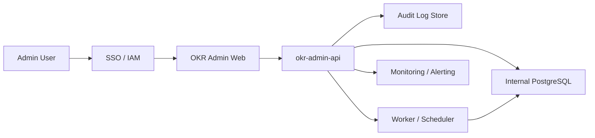

# OKR Admin Internalization Build Blueprint v0.2

> 현재 프로토타입(`prototype/`)을 참고해, 사내에서 실제 운영할 신규 OKR Admin을 구축하고 런칭하기 위한 실행 청사진

## 문서 메타
| 항목 | 내용 |
| --- | --- |
| 작성일 | 2026-02-23 |
| 문서 버전 | v0.2 |
| 범위 | 프로토타입 참고 기반 신규 운영 어드민 구축/런칭 |
| 대상 | PM/도메인 리드, 엔지니어, 보안/플랫폼, 운영 담당 |
| 기준 문서 | `/Users/ungs2/Documents/100. Projects/codex-okr-dashboard/docs/POLICY_AND_OPERATING_GUIDE_v1.3.0.md` |

---

## 1. 구축 목표
| 목표 | 설명 | 성공 기준 |
| --- | --- | --- |
| 보안/권한 내재화 | 사내 SSO + RBAC 기반 신규 어드민 구축 | 내부 계정/권한 정책 감사 통과 |
| 데이터/플랫폼 내재화 | Supabase 제거, 내부 DB+API 기반으로 운영 | 내부 인프라만으로 기능 정상 동작 |
| 운영 체계 내재화 | 모니터링/감사/장애 대응 체계 포함 런칭 | 런북 기반 복구 리허설 완료 |

## 2. 범위 정의 (In / Out)
| 구분 | 항목 |
| --- | --- |
| In Scope | Objective/KR/Sub-KR/Initiative/Experiment/Input/Notifications/Total Table 운영 기능 구축 |
| In Scope | 내부 인증/인가, 감사로그, 운영 대시보드, 백업/복구, 배포 파이프라인 구축 |
| Out of Scope (초기) | 구축과 무관한 신규 제품 기능 실험, 대규모 UX 재설계 |

---

## 3. 현재 vs 목표 갭
| 영역 | 현재 상태(프로토타입) | 목표 상태(신규 운영 어드민) | 갭 요약 | 우선순위 |
| --- | --- | --- | --- | --- |
| 인증/인가 | 강제 인증/권한 모델 미흡 | 사내 SSO + 역할 기반 권한 제어 | 보안 경계 부재 | P0 |
| 데이터 저장소 | Supabase 의존 | 사내 PostgreSQL 기반 | 인프라/정책 종속 | P0 |
| API 운영 | 단일 앱 내 API | 내부망 `okr-admin-api` 분리 운영 | 배포/확장/관측 분리 필요 | P0 |
| 감사/추적 | 감사 기능 존재하나 정책 연동 제한적 | 불변성/보존기간/권한이 명확한 감사체계 | 컴플라이언스 기준 미흡 | P1 |
| 운영 자동화 | 수동 운영 중심 | 알림/백업/복구/온콜 자동화 | 장애 대응 시간 리스크 | P1 |

## 4. 타겟 아키텍처
| 레이어 | 타겟 구성 |
| --- | --- |
| Frontend | 사내 SSO 연동 어드민 웹 |
| Backend API | 내부망 서비스 `okr-admin-api` |
| DB | 사내 PostgreSQL (권장) |
| Async | 배치/이벤트 워커 (알림 생성, 외부 동기화) |
| Observability | 중앙 로그, 메트릭, 트레이싱, 알람 |

---

## 5. 구축 원칙
| 원칙 | 적용 방식 |
| --- | --- |
| API Contract First | OpenAPI를 기준으로 FE/BE 병렬 개발 및 변경 관리 |
| Build for Operations | 구축 단계에서 운영/관측/감사 요구사항을 함께 구현 |
| Launch Readiness Gate | 런칭 전 체크리스트/검증 통과 시에만 서비스 오픈 |
| Immutable Audit | 모든 쓰기 이벤트를 변경 불가 감사 로그로 저장 |
| Fail Safe Launch | 런칭 중 문제 발생 시 즉시 fallback 가능한 절차 사전 검증 |

## 6. Workstream 상세
| Workstream | 핵심 작업 | 주요 산출물 | Done 기준 |
| --- | --- | --- | --- |
| 플랫폼/보안 | SSO 연동, RBAC, 시크릿 관리 | 인증/권한 설계서, 권한 매트릭스 | 권한 시나리오 테스트 통과 |
| 데이터 | 내부 DB 스키마, 데이터 적재/이관 스크립트, 정합성 검증 | DDL, 적재 리포트 | 샘플/실데이터 정합성 기준 충족 |
| API | 내부 표준 에러 규약, 업무/운영 API 분리 | OpenAPI, API 구현 | 핵심 API 회귀 테스트 통과 |
| 프론트 | 내부 API 연동, 권한 기반 메뉴/액션 제어 | 화면/권한 매핑 표 | 권한별 UI 접근 제어 확인 |
| 운영 | 모니터링/알람/런북/온콜 체계 | 운영 런북, 알람 룰 | 장애 대응 리허설 완료 |

---

## 7. 단계별 로드맵
| Phase | 기간(가이드) | 목표 | 주요 작업 | Exit Criteria |
| --- | --- | --- | --- | --- |
| Phase 0 설계 확정 | 1~2주 | 기준 확정 | 도메인/권한/감사/보안 정책 확정, API/DB 초안 리뷰 | 설계 승인 + 의사결정 로그 확정 |
| Phase 1 내부 MVP 구축 | 3~5주 | 동작 가능한 내부 최소버전 구축 | 내부 DB/API, SSO/RBAC, 핵심 기능 구현 | 핵심 기능 E2E 통과 |
| Phase 2 운영성 강화 | 2~4주 | 운영 품질 확보 | Notifications/Total Table 고도화, 관측/백업/복구 자동화 | 운영 KPI/알람 기준 충족 |
| Phase 3 Go-live 준비/오픈 | 1~2주 | 신규 어드민 운영 오픈 | 런칭 리허설, 초기 데이터 적재, 서비스 오픈, hypercare | 런칭 승인 + 안정화 기준 충족 |

## 8. Go-live 전략
| 단계 | 운영 모드 | 검증 포인트 | 중단/보류 조건 |
| --- | --- | --- | --- |
| Step 1 | 런칭 리허설 | 오픈 시나리오/시간/검증항목 사전 통과 | 리허설 실패 또는 미완료 |
| Step 2 | 초기 데이터 반영 | 운영 시작 기준 데이터 적재 및 정합성 검증 통과 | 정합성 검증 실패 |
| Step 3 | 서비스 오픈 + Hypercare | 오픈 후 KPI/에러율/복구성 안정 | 핵심 API SLO 미충족 |

---

## 9. 리스크 레지스터
| 리스크 | 영향도 | 가능성 | 완화 전략 | 모니터링 지표 |
| --- | --- | --- | --- | --- |
| 권한/조직 모델 변경에 따른 API 재설계 | 높음 | 중간 | 권한 매트릭스 선확정, 변경관리 프로세스 적용 | 스펙 변경 건수/주 |
| 내부 연동 API 스키마/버전 드리프트 | 중간 | 중간 | 인터페이스 버전 고정, 계약 테스트 자동화, 변경 알림 SLA 합의 | 계약 테스트 실패 건수 |
| 런칭 직후 장애/성능 저하 | 높음 | 중간 | 오픈 전 부하/장애 리허설, 모니터링 알람 강화 | 오픈 후 오류율, 지연시간 |

## 10. 즉시 의사결정 항목
| 결정 항목 | 선택지 | 권장안 | 결정 기한 |
| --- | --- | --- | --- |
| 내부 DB 엔진 | PostgreSQL / MySQL | PostgreSQL | Phase 0 종료 전 |
| 인증 주체 | SSO claim 스키마 정의 | 사내 IAM 표준 claim | Phase 0 종료 전 |
| 감사로그 정책 | 보존기간/조회권한/마스킹 | 보안팀 표준 정책 준수 | Phase 0 종료 전 |

---

## 11. 산출물 및 참조
| 유형 | 경로 | 상태 |
| --- | --- | --- |
| API 스펙 초안 | `/Users/ungs2/Documents/100. Projects/codex-okr-dashboard/architecture/internal-openapi-draft-v0.1.yaml` | Draft |
| DB DDL 초안 | `/Users/ungs2/Documents/100. Projects/codex-okr-dashboard/architecture/internal-db-schema-draft-v0.1.sql` | Draft |
| Go-live Runbook | `/Users/ungs2/Documents/100. Projects/codex-okr-dashboard/docs/INTERNALIZATION_GO_LIVE_RUNBOOK_v0.1.md` | Draft |

## 12. 진행 체크리스트
- [ ] Phase 0 설계 승인 완료
- [ ] SSO/RBAC 통합 테스트 완료
- [ ] 내부 DB 이관/적재 리허설 완료
- [ ] 핵심 API 회귀 테스트 자동화 완료
- [ ] Go-live 리허설 완료
- [ ] 최종 Go-live 승인 획득
